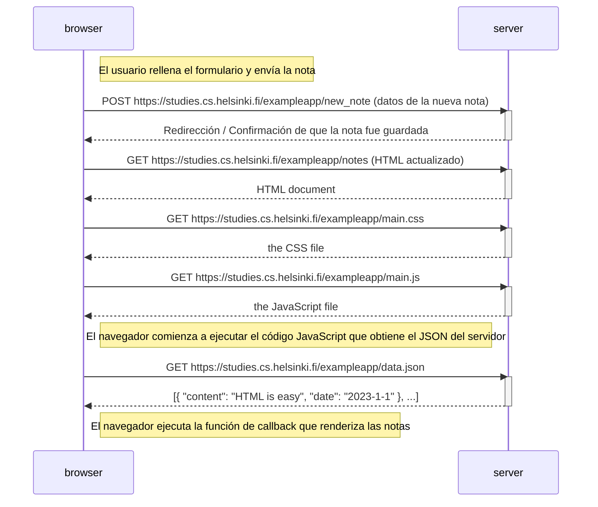

```
sequenceDiagram
    participant browser
    participant server

    Note right of browser: El usuario rellena el formulario y envía la nota

    browser->>server: POST https://studies.cs.helsinki.fi/exampleapp/new_note (datos de la nueva nota)
    activate server
    server-->>browser: Redirección / Confirmación de que la nota fue guardada
    deactivate server

    browser->>server: GET https://studies.cs.helsinki.fi/exampleapp/notes (HTML actualizado)
    activate server
    server-->>browser: HTML document
    deactivate server

    browser->>server: GET https://studies.cs.helsinki.fi/exampleapp/main.css
    activate server
    server-->>browser: the CSS file
    deactivate server

    browser->>server: GET https://studies.cs.helsinki.fi/exampleapp/main.js
    activate server
    server-->>browser: the JavaScript file
    deactivate server

    Note right of browser: El navegador comienza a ejecutar el código JavaScript que obtiene el JSON del servidor

    browser->>server: GET https://studies.cs.helsinki.fi/exampleapp/data.json
    activate server
    server-->>browser: [{ "content": "HTML is easy", "date": "2023-1-1" }, ...]
    deactivate server

    Note right of browser: El navegador ejecuta la función de callback que renderiza las notas
```

